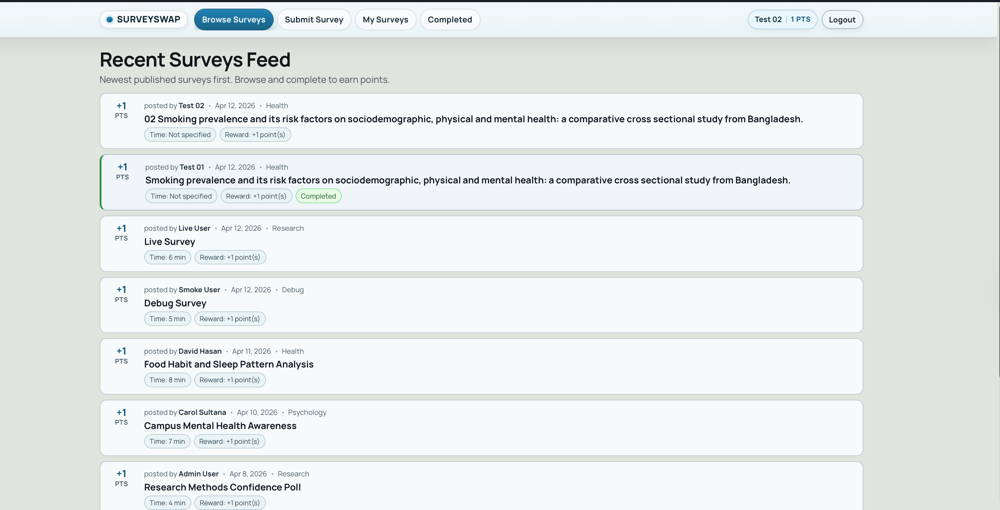

# SurveySwap

SurveySwap is a student-first platform where users exchange survey participation and earn points to publish their own surveys.



## Requirements
- PHP 8.1+
- MySQL 8+

## 1) Create database
From project root, import the schema:

```bash
mysql -u root -p < database/schema.sql
```

Optional demo data:

```bash
mysql -u root -p surveyswap < database/seed.sql
```

## 2) Configure environment
Create `.env` in the project root:

```env
APP_ENV=local
BASE_URL_OVERRIDE=
DB_HOST=127.0.0.1
DB_PORT=3306
DB_NAME=surveyswap
DB_USER=your_db_user
DB_PASS=your_db_password
```

## 3) Run the app

### macOS
```bash
php -S localhost:8000
```
Open: `http://localhost:8000`

### Windows (MSYS2)
From **MSYS2 UCRT64** shell:

Install PHP and MySQL client (one-time):

```bash
pacman -S --needed mingw-w64-ucrt-x86_64-php mingw-w64-ucrt-x86_64-mariadb
```

Optional: verify PHP is available:

```bash
php -v
```

Then go to the project root and run:

```bash
cd /c/Users/jishan/Code/survery-swap
```

```bash
php -S localhost:8000
```
Open: `http://localhost:8000`
